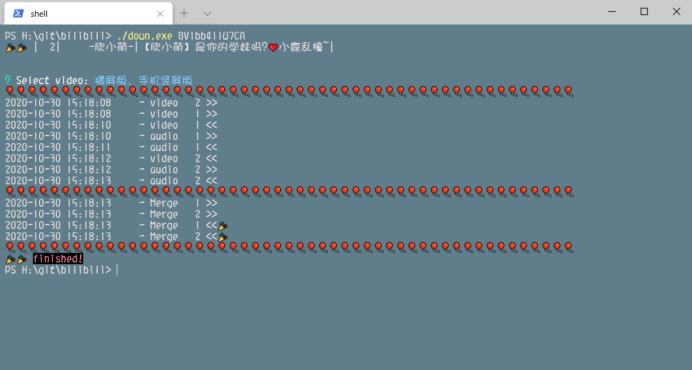

# bilibili视频下载器
~~~shell script
Author: gdream@yeah.net
~~~
> 特此声明：此项目仅供学习使用。如有侵权等法律问题，请尽快联系我删除。如有人用作违法或商业等用途，因此产生的一切法律问题由其个人负责和承担，本项目维护者概不负责。

## 使用方式
注意: 为了合并音视频，本机需要安装ffmpeg，并配置环境变量（Docker方式和Flutter-App不需要安装）。

1. Linux: sudo apt/yum/snap install ffmpeg
2. Macos: sudo brew install ffmpeg
3. Windows: [下载ffmpeg](https://github.com/BtbN/FFmpeg-Builds/releases)

## 使用详明
# 命令行工具 或 GUI界面
[Release地址](https://github.com/ggdream/bilibili/releases)
~~~sh
如果你不是相关开发者，那么我强烈推荐你使用这种方式安装。将路径添加到环境变量中即可在全路径下使用
- 命令行工具支持：Windows,Linux,MacOS
- GUI支持：Android,iOS,Windows,Linux
~~~

# Golang
[分支地址](https://github.com/ggdream/bilibili/tree/golang)
~~~sh
# 如果你是一位Gopher，那么推荐你使用这种方式进行安装
$ go get github.com/ggdream/bilibili    # 会自动编译成二进制文件到$GOBIN下
$ bilibili <BV_Number>                              # 其他功能使用($bilibili --help)查看帮助
~~~

# Python
[分支地址](https://github.com/ggdream/bilibili/tree/python)
~~~sh
$ git clone -b python https://github.com/ggdream/bilibili.git
$ cd bilibili/ && pip install -r requirements.txt
$ python bilibili.py              # 交互式读取输入
~~~

# Docker
~~~sh
$ docker run -d -v /tmp:/data ggdream/bilibili <BV_Number>  # 其他功能使用($down --help)查看帮助
~~~
